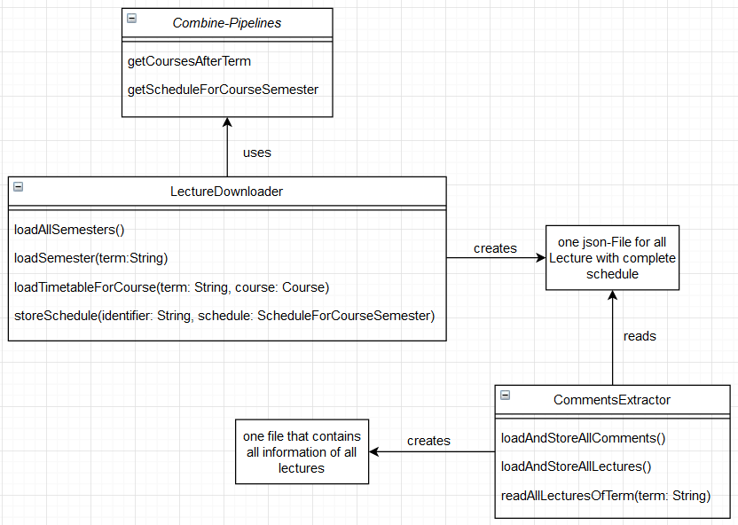

# CommentsFetcher

**Code und Dokumentation:** Max Großmann (max-grossmann, MaaxGr) und Marvin Jakob (mjakob3)

***

## Einleitung

Der CommentsFetcher dient dazu an die Daten der Vorlesung - z.B. Kommentare - zu kommen. Dafür werden Combine-Pipelines genutzt. Diese holen sich mit der Hilfe der Hochschul-API Daten vom Server. Mit den heruntergeladenen Informationen der Vorlesungen kann die LectureAI getestet werden.

*In der finalen App wird der CommentsFetcher nicht gebraucht*

## Aufbau

## LectureDownloader

Der LectureDownloader ist ein Clerk, welcher die Daten aller Vorlesungen herunterlädt, indem er die Pipeline-Klasse verwendet. Die Daten werden dann in json-files gespeichert. 

*Der LectureDownloader wird nur zum Testen der LectureAI gebraucht. Nachdem die Vorlesungen heruntergeladen wurden, wird er nicht mehr gebraucht*.

## Pipelines

* bietet Methoden, mit welchen der LectureDownloader arbeiten kann.
* Methoden greifen auf die API der Hochschule zu, um an Daten des Stundenplans zu gelangen
* Dabei werden Combine-Pipelines genutzt

## CommentsExtractor

Der CommentsExtractor ist ein Clerk, welcher die Kommentare aus lokalen Daten lädt. Diese Daten, welche Informationen zu den Vorlesungen enthalten, wurden vorher vom LectureDownloader bereitgestellt.

* die Methode loadAndStoreAllComments() filtert dabei alle Kommentare aus den Daten und speichert sie dann in eine eigen json-file (comments.json)

* Das ComentInfo-struct bestimmt, welche Informationen aus den Files geladen werden sollen 

## Models

Die Models richten sich nach der Datenstruktur der Hochschul-API. Aus dieser Struktur wurden Structs erstellt, um die Studiengänge, Vorlesungen, Änderungen, etc. abbilden zu können.

## Tests 

* alle Tests mit `swift test` ausführen
* Test können gefiltert werden
    * Beispiel: Nur Tests der DatenUtilTests Klasse ausführen: `swift test --filter DateUtil`

