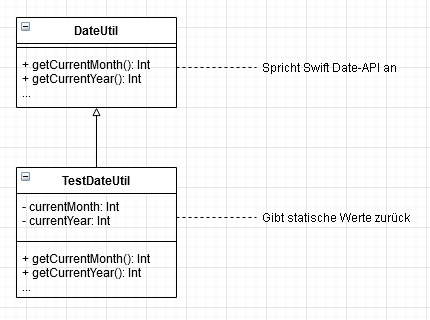

# Unit Tests

## Allgemein
Um sicherzustellen, dass gewisse Programlogiken richtig funktionieren, werden Unit-Tests angelegt.

Alle Unit-Tests können über folgenden Befehl ausgeführt werden:

```text
swift test
```

Soll nur ein bestimmter Test ausgeführt werden, kann dieser über den Methodennamen gefiltert werden:

```text
swift test --filter swift test --filter testParseStringify
```

## Philosophie

Tests sollen unabhängig von dem Zeitpunkt und sonstigen abweichenden Gegebenheiten, 
wie Internet-Verbindung oder externen Schnittstellen lediglich die Geschäftslogik überprüfen.

Da in diesem Program sehr viel mit Zeitpunkten und Kalenderwochen gearbeitet wird, 
werden Aufrufe zur Swift Date-API nur aus der Klasse `DateUtil` angestoßen.
Für Tests besteht außerdem eine Ableitung `TestDateUtil` (TODO: Verlinkung), welche die Methode
`getCurrentMonth()` und `getCurrentYear()` überschreiben und statische Zeitpunkte zurückgeben.
Dadurch ist sichergestellt, dass die Tests zu jedem Zeitpunkt funktionieren.

